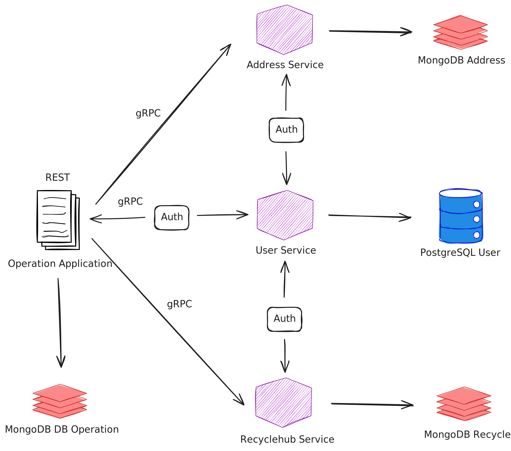
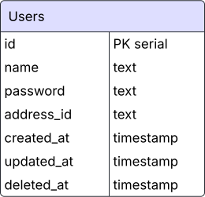

# Wasted4Future ❌

[Feel free to try this API. Click to access the documentation.](https://blank.page/)

## Description: 

Waste4Future is an on-demand waste collection service that simplifies recycling and promotes sustainability. Acting as the bridge between waste producers and recycling hubs, Waste4Future offers a hassle-free way for households and businesses to responsibly dispose of their waste.Customers can schedule waste pickups, and our dedicated collection team will ensure that all materials are properly sorted and delivered to the appropriate recycling centers. Waste4Future makes sustainable waste management more accessible, efficient, and impactful for a cleaner tomorrow.

## Background:

> Fueled by a simple yet powerful question—"What if waste collection was as seamless as booking a ride?"—we set out to redefine how waste is managed in urban environments. Inspired by platforms like Uber and Grab, we didn’t just want to build another app; we wanted to engineer a system that makes sustainable waste disposal effortless, efficient, and impactful.

## Highlights:

* Microservices Architecture
* Serverless Deployment with Google Cloud Run
* Email notifications

### Tech stacks:

* Go
* Echo
* gRPC
* Docker
* Google Cloud Platform
* PostgreSQL
* MongoDB
* JWT-Authorization
* 3rd Party APIs (Xendit, Google Maps)
* SMTP
* REST
* Swagger
* Testify?

## Application Flow ❌



## ERD

### User Service (Postgres) ❌



### Merchant Service (Postgres)

 ❌

### Order Service (MongoDB) ❌


## Deployment

This app is containerized and deployed to Google Cloud Run as a microservices. This means for each service (user_service, address_service, recyclehub_service, and operation_service) is a separate instance. 

To deploy, go to the root folder for each service and type:

❌

```bash
gcloud builds submit --pack image=gcr.io/[PROJECT-ID]/[SERVICE-NAME]
```

- __PROJECT-ID__ refers to the project's ID on Google Cloud Console.
- __SERVICE-NAME__ refers to the service name that you want to deploy. Example: order-service.